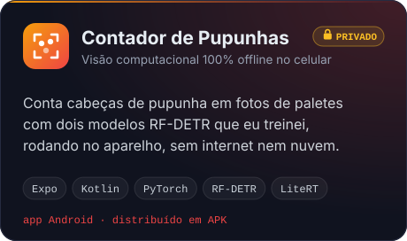
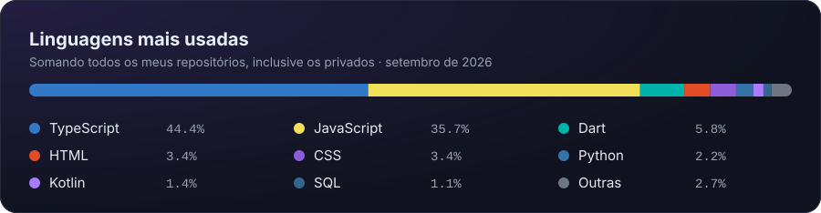

  

## 👨‍💻 Sobre mim

- Desenvolvedor **full-stack e mobile**: faço o produto inteiro, do banco de dados e das APIs até a tela e a publicação na loja.
- Trabalho com **IA aplicada**: treinei modelos de visão computacional que rodam **offline no celular** e coloco IA generativa dentro de produtos reais.
- **Web** com Next.js e TypeScript · **Android** com React Native, Expo, Capacitor e Flutter · **desktop** com Tauri e Rust.
- Também sou **editor de vídeo e motion designer**. [Veja o portfólio →](https://julio-cesar-luchini.netlify.app)

## 🚀 Projetos em destaque

  
  
  
  

O código do Visor Crypto é aberto: <a href="https://github.com/Juliocesar7881/Visor-Crypto">Juliocesar7881/Visor-Crypto</a>

## 🛠️ Tecnologias

  <b>WEB &amp; BACK-END</b>  
    
  <b>MOBILE, DESKTOP &amp; IA</b>  
    
  <b>INFRA &amp; CRIAÇÃO</b>  
  

## 📈 Atividade

  
  

<picture>
  <source media="(prefers-color-scheme: dark)" srcset="https://raw.githubusercontent.com/Juliocesar7881/Juliocesar7881/output/cobrinha-escura.svg">
  <source media="(prefers-color-scheme: light)" srcset="https://raw.githubusercontent.com/Juliocesar7881/Juliocesar7881/output/cobrinha-clara.svg">
  
</picture>

